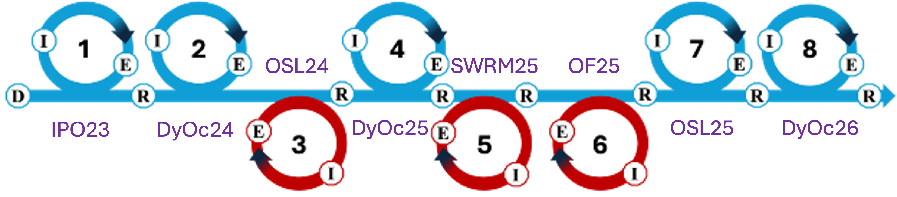
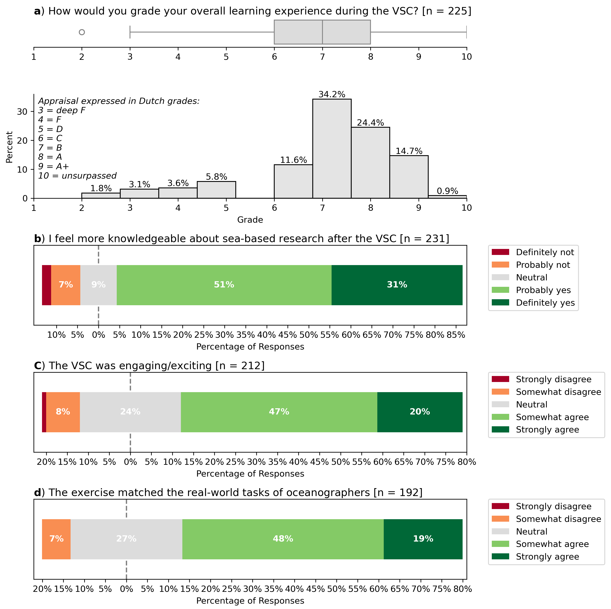
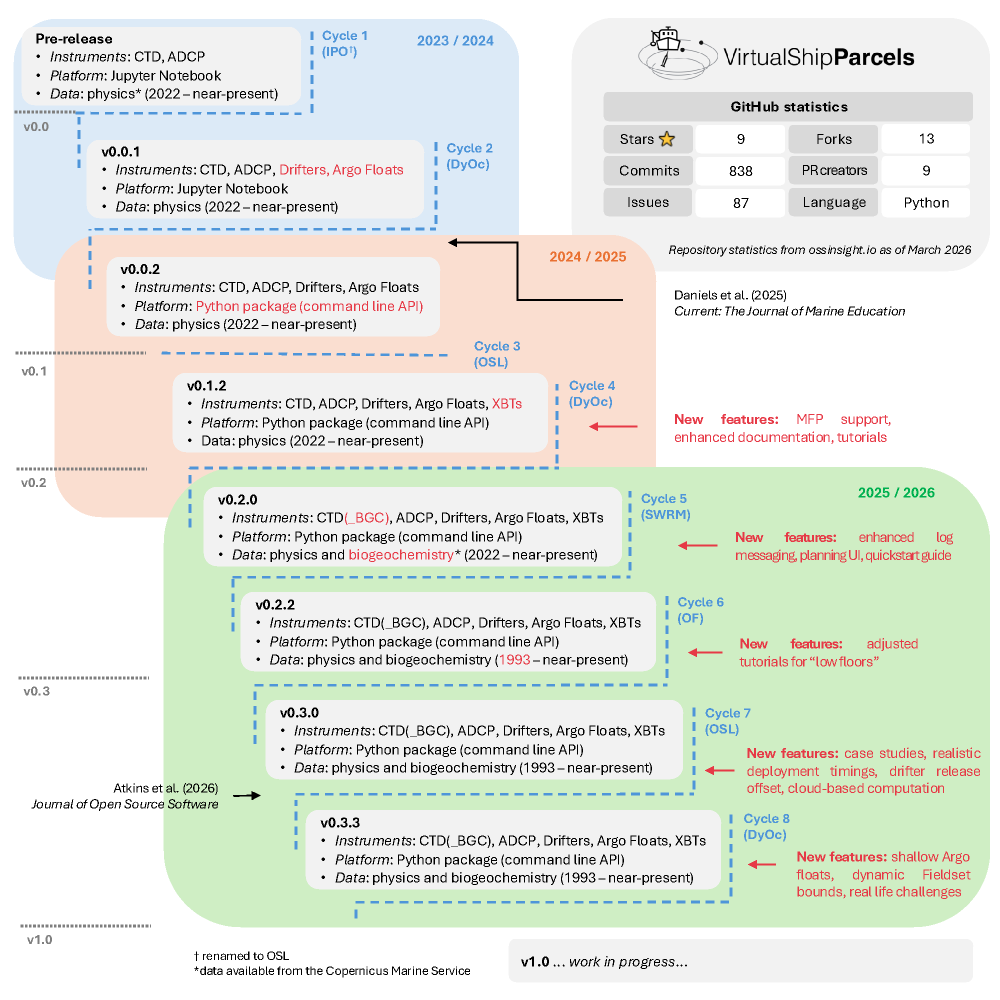
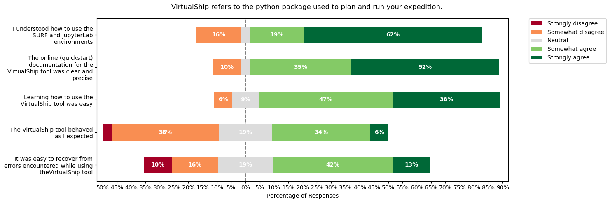
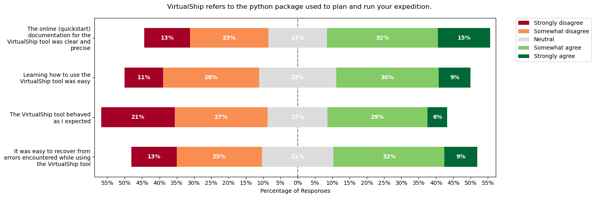
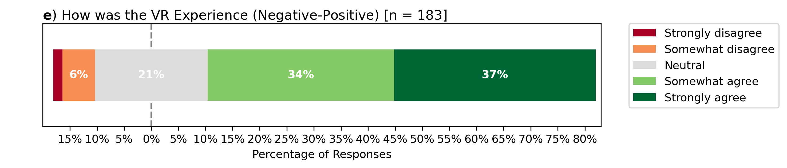

## Agenda

1. Updates
2. Gliders
3. Gamification
4. AOB

## Team composition

<!-- TODO: add photos? -->

- New team members:
    - Jamie (Postdoc)
    - Gonçalo (Research Officer)

## VirtualShip Classroom in new courses {.smaller}

**At UU...**

- In total 4 courses at UU (8 cycles), with implementation in each to continue in 2026/2027.
- Implementation has been extended to two new courses:
    - Ocean of the Future [**BSc**; Geosciences]
    - Sustainable Water Resources Management [MSc; Geosciences]
        - 4 hour 'masterclass'

{height=200px}

## VirtualShip Classroom in new courses {.smaller}

**Beyond UU... !**

- €100k NKO funding to implement the VirtualShip Classroom at four new universities in the Netherlands:
    - TU Delft
    - University of Amsterdam
    - Wageningen University and Research
    - University of Groningen

- Mixture of BSc and MSc courses, ranging from ecology to physics.
- Implementation to start in 2026/2027, for two academic years.
- A transition from us actively supporting the implementation at each university to a more hands-off approach.

## Student evaluation (at UU){.smaller style="font-size: 0.6em;"}

 
Across 8 cycles of teaching (pooled results)...

{height=100%}

## Updates to the software {.smaller}

The software has updated over the last year... often in line with evolving user needs and feedback from students.

{height=100%}

## Student evaluation (at UU){.smaller style="font-size: 0.6em;"}

**Software** evaluation from students' perspective is less positive.

{height=100%}

## Student evaluation (at UU){.smaller style="font-size: 0.6em;"}

And even more challenging for **BSc** students with mixed programming experience.

{height=100%}

## VR / 360° videos

- 2024/2025: shorter videos, ship tours, scientist interviews and one instrument-focused video (ADCP).
- **2025/2026**: 4 new longer videos (more instruments, day-at-sea videos) from DUST expedition that Emma and Gonçalo participated in.
    - Newer videos after Gonçalo had 7 months more training in editing skills.
- New bespoke video player application designed with the AV team at UU.
    - Focusing on ability to deploy videos to students asynchronously.

## VR / 360° videos {.smaller style="font-size: 0.6em;"}



## VR / 360° videos

 

{height=100%}

With more in-depth evaluation in Bhagat _et al._ (in review).

## Publications {.smaller style="font-size: 0.6em;"}

**Published**:

1.  Daniels, E., Chytas, C. and van Sebille, E. 2025. The Virtual Ship Classroom: Developing Virtual Fieldwork as an Authentic Learning Environment for Physical Oceanography. _Current:  The Journal of Marine Eduction_. 40(2), p. 44–57. https://doi.org/10.5334/cjme.121.

Evaluation of first two DBR cycles in teaching at UU.

**Submitted/in review**:

2.  Bhagat, S. , Daniels, E. and Veldkamp, A. Authentic Learning in Marine Science Education Using Immersive 360˚ Videos. _Journal of Geoscience Education_.

Evaluation of __VR__ in first two DBR cycles in teaching at UU.

3.  Atkins, J., Daniels, E., Hodgskin, N., Stuurman, A., Simoes-Sousa, I. and van Sebille, E. VirtualShip: A Python package for simulating oceanographic fieldwork in the global ocean. _The Journal of Open Source Software_.

Presenting and describing the VirtualShip Python package.

4.  Atkins, J., Daniels, E. and van Sebille, E. The VirtualShip Classroom: Simulating Fieldwork in the Global Ocean. _Oceanography: Education_.

For teachers: overview & deploying the VSC in class.

**In prep**:

5.  Daniels, E., Atkins, J. and van Sebille, E. Design-based research about virtual oceanography fieldwork as an authentic learning environment. _Journal of Computing in Higher Education_.

Evaluation & insights from eight DBR cycles (incl. derived design principles).

## Other updates

- We have partnered with the National Marine Facilities (NMF) to join their 'roadshow' (focused around new AWvB ship) and promote VirtualShip to new users.
- VU Amsterdam, TU Delft, Radboud University, University of Groningen and UU.

## What's next?

- Implementation at new universities as part of NKO scale-up project.
- Continued development of the software, VR and teaching material.
- Continued evaluation of resources and implementations.
- ... which leads us to the next agenda items!

## Discussion point: Gliders

_How to integrate and work with gliders in the VirtualShip Classroom?_

## Discussion point: Gamification

_How can/should we incorporate gamification into the VirtualShip Classroom?_

_How does it relate to authenticity?_
