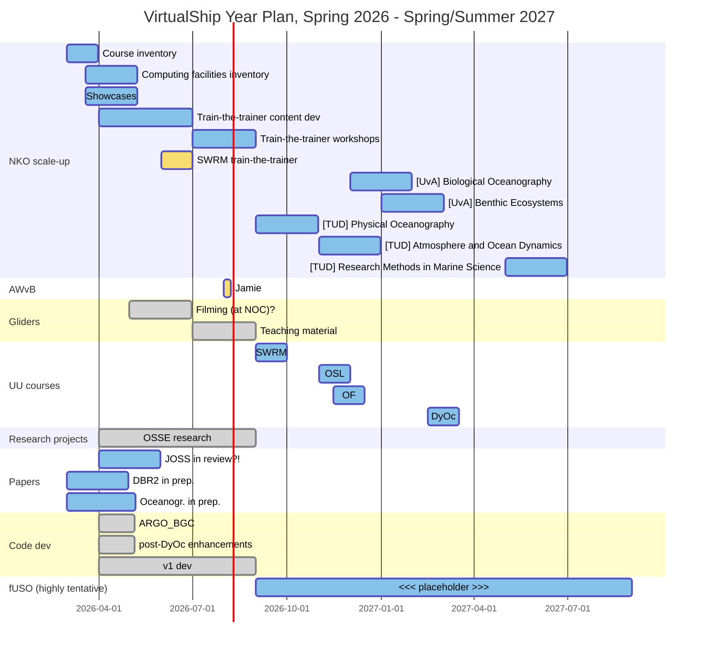

```mermaid
---
config:
  theme: default
---
%%{init: { 'themeVariables': {
    'doneTaskBkgColor': '#d3d3d3',
    'activeTaskBkgColor': '#85C1E9',
    'taskBkgColor': '#F7DC6F',
    'critBorderColor': '#ff0000'
}}}%%
gantt
    title VirtualShip Year Plan, Spring 2026 - Spring/Summer 2027
    dateFormat  YYYY-MM-DD
    tickInterval 3month
    weekday monday

    section NKO scale-up
    Course inventory    :active, 2026-03-01, 30d
    Computing facilities inventory :active, 2026-03-19, 50d
    Showcases           :active, 2026-03-19, 50d
    Train-the-trainer content dev   :active, 2026-04-01, 91d
    Train-the-trainer workshops :active, 2026-07-01, 62d
    SWRM train-the-trainer :future, 2026-06-01, 30d
    [UvA] Biological Oceanography :active, 2026-12-01, 60d
    [UvA] Benthic Ecosystems :active, 2027-01-01, 60d
    [TUD] Physical Oceanography :active, 2026-09-01, 60d
    [TUD] Atmosphere and Ocean Dynamics :active, 2026-11-01, 60d
    [TUD] Research Methods in Marine Science :active, 2027-05-01, 60d


    section AWvB
    Jamie :, 2026-07-31, 7d

    section Gliders
    Filming (at NOC)? :done, 2026-05-01, 60d
    Teaching material :done, 2026-07-01, 62d

    section UU courses
    SWRM :active, 2026-09-01, 30d
    OSL :active, 2026-11-01, 30d
    OF  :active, 2026-11-15, 30d
    DyOc :active, 2027-02-15, 30d

    section Research projects
    OSSE research :done, 2026-04-01, 153d

    section Papers
    JOSS in review?! :active, 2026-04-01, 60d
    DBR2 in prep. :active, 2026-03-01, 60d
    Oceanogr. in prep. :active, 2026-03-01, 67d

    section Code dev
    ARGO_BGC :done, 2026-04-01, 35d
    post-DyOc enhancements :done, 2026-04-01, 35d
    v1 dev       :done, 2026-04-01, 153d


    section fUSO (highly tentative)
    <<< placeholder >>> :active, 2026-09-01, 365d

```
