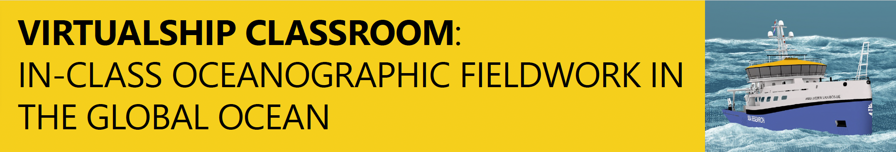
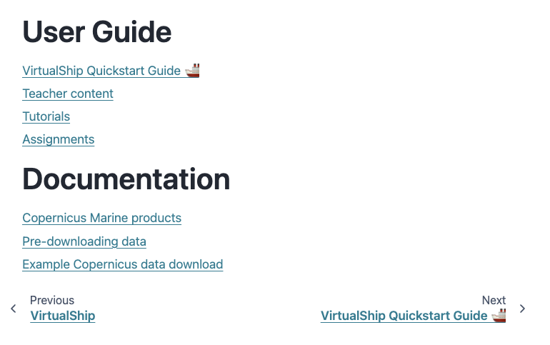
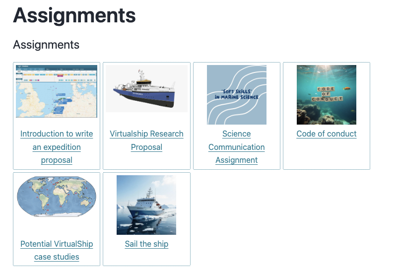
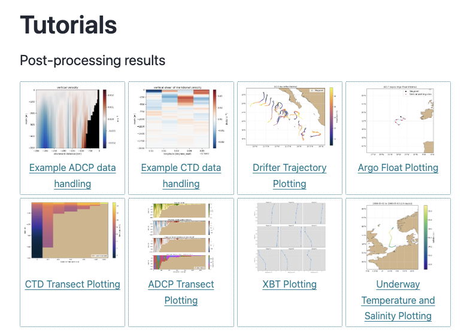
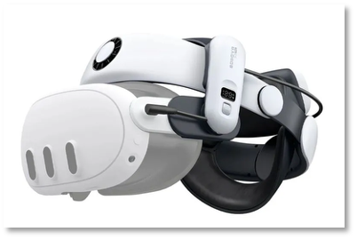
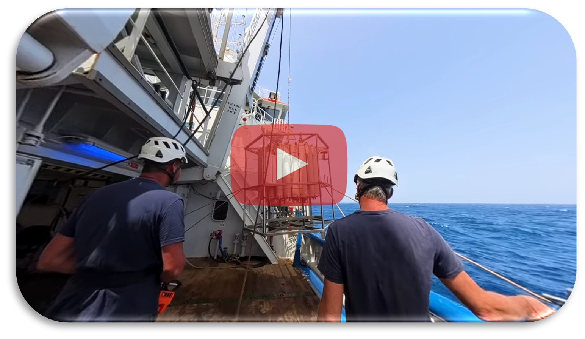
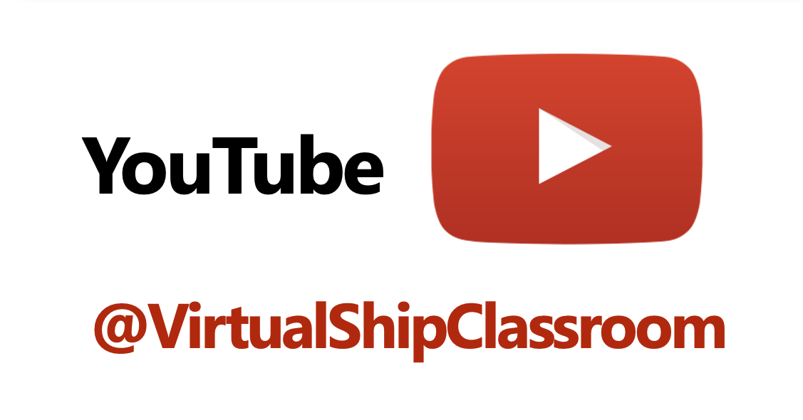
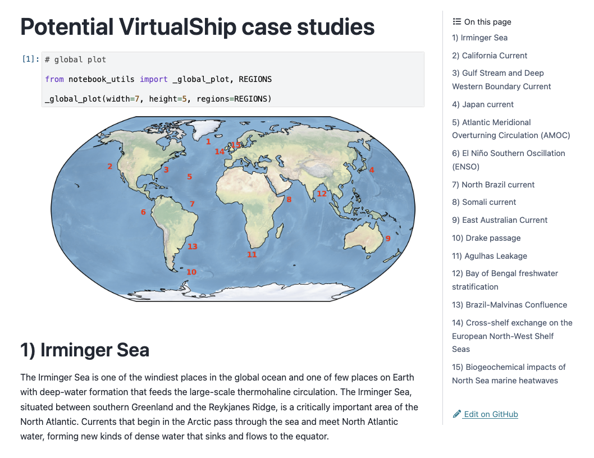
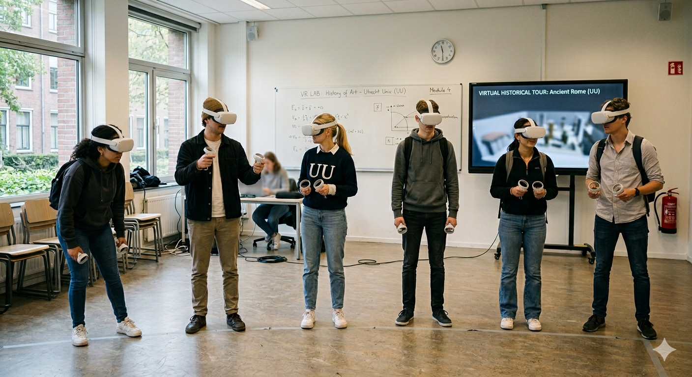
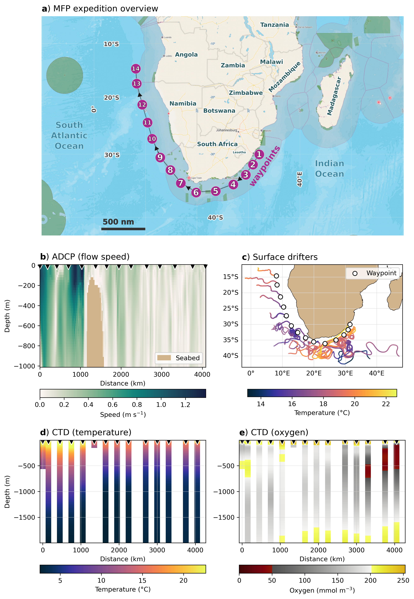

##  {.smaller}

:::{.callout-note}
_Marine science relies on fieldwork for data collection, yet sea-going opportunities are limited for students and researchers._
:::

- VirtualShip offers an alternative means for training scientists to conduct oceanographic fieldwork in an authentic manner
- Not just the **science** but also the **experience** of sea-going research
    - End-to-end expedition pipeline
    - Challenges and nuances of real-world oceanographic work

## The VirtualShip Classroom

```{dot}
graph G {
    // "sketchy" look
    graph [ranksep=0.5, nodesep=0.4];
    node [
        fontname="Comic Sans MS",
        fontsize=13,
        shape=box,
        style="filled, sketchy",
        fillcolor="#fff3b0",
        color="#333333",
        penwidth=1.5,
        margin="0.3,0.2"
    ];
    edge [
        style=sketch,
        color="#333333",
        penwidth=1.2
    ];

    // nodes
    A1 [label="VirtualShip Classroom", distortion=0.05];

    B1 [label="Open Education Resources", skew=0.02];
    B2 [label="VirtualShip Software", distortion=-0.03];
    B3 [label="Virtual Reality / 360° videos", skew=-0.02];

    // connections
    A1 -- B1;
    A1 -- B2;
    A1 -- B3;
}
```

## Open Education Resources

- A collection of accessible materials (assignments, tutorials, rubrics) for educators.
    - Designed to complement the VirtualShip software and VR content.
- Freely available on our `Docs` and `edusources`.


::: {layout-ncol=3 layout-valign="top"}







:::

## VirtualShip Python package {.smaller}

- The open-source software that simulates oceanographic measurements anywhere in the global ocean.
- Simulates measurements in a _digital_ ocean as if they are coming from real-life oceanographic instruments
    - Including CTDs, ADCP, Drifters, Argo floats, and more.

::: {layout-ncol=3 layout-valign="top"}

{height="200px"}

{height="200px"}

{height="200px"}

:::

## The VirtualShip software internals {.smaller}


- <span style="vertical-align: middle;">
    {width=250}
    </span>
    - Lagrangian trajectory framework
    - Instruments have behaviours via customisable, extensible `kernels`
    - VirtualShip = `kernel`s + configuration + digital ocean

    <!-- <br> -->

- <span style="vertical-align: middle;">
    {width=250} </span>
    - The digital ocean
    - Data ingestion is by default 'streamed' via `copernicusmarine` Python toolbox (on-the-fly)
    - With an option to pre-download to ingest (any gridded forcing data) from disk


## Virtual Reality / 360° videos

- Immersive media to provide an authentic, engaging experience of sea-going research and novel concepts.

::: {layout-ncol=3 layout-valign="top"}

{height="200px"}

{height="200px"}

{height="200px"}

:::

## Example workflow (Introduction) 🚢 {.smaller}

:::{.callout-note}
All components of the VirtualShip Classroom are intentionally designed to be modular, allowing educators to tailor the experience to their specific needs and goals.
:::

::: {.columns}

::: {.column width="50%"}
1) Introductory lecture on oceanographic fieldwork and the VirtualShip Classroom
2) Complete a code of conduct (group work)
3) Choose (case study) region and design research questions
4) Submit a proposal to the VirtualShip 'committee' (instructor/teachers) for feedback and approval
:::

::: {.column width="50%"}

:::

:::

## Example workflow (VR component) 🚢 {.smaller}

- Intersperse the workflow with the VR content.
- Effective in 'transporting' students to the ship and ocean, and mixes up from desk-based activities.


::: {.columns layout-valign="top"}

::: {.column width="50%"}

:::

::: {.column width="50%"}
<video src="media/ship_still.mp4" controls autoplay loop ></video>
:::

:::


## Example workflow (Software) 🚢

- Using the VirtualShip software to conduct the expedition in a digital ocean.
- Now a live demo...


## Example workflow (Results) 🚢

::: {layout-ncol=1 style="display: flex; justify-content: center;"}



:::

## Example workflow (Results) 🚢

Argo Float deployment

<iframe src="media/argo_plot.html" data-external="1" width="100%" height="800px" frameborder="0"></iframe>


## Example workflow (Assessment) 🚢

- Flexible assessment options, including:
    - Written report
    - Oral presentation
    - Post-processing code submission
    - Group project
- ... or none!


## Links & getting in touch


**Project email**: [virtualship@uu.nl](mailto:virtualship@uu.nl)

**VritualShip website**: [virtualship.parcels-code.org/](https://virtualship.parcels-code.org/)

**GitHub**: [github.com/Parcels-code/virtualship](https://github.com/Parcels-code/virtualship)


::: {layout-ncol=2 layout-valign="top"}

{height="200px"}

{height="200px"}


:::
