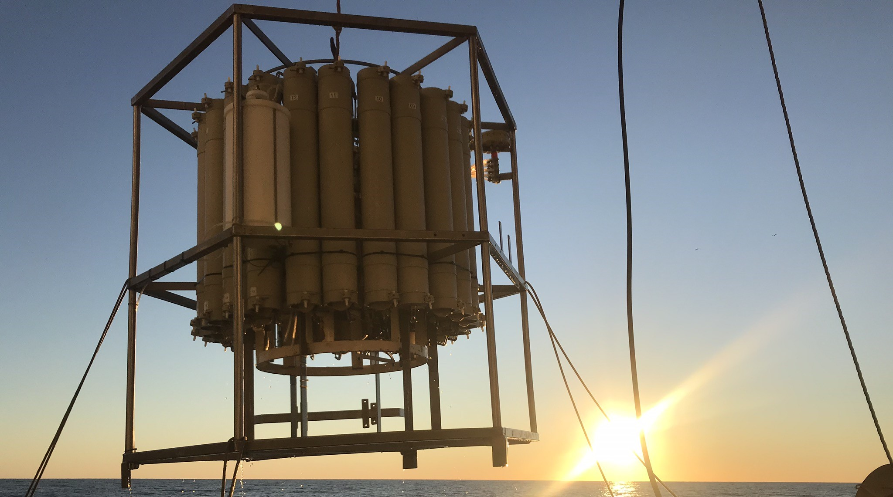
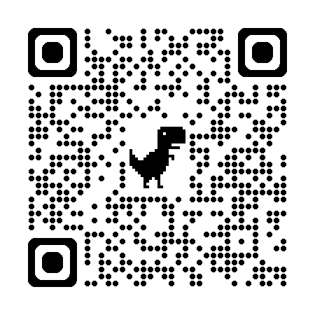
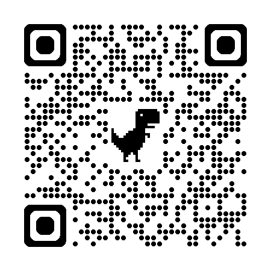

## {height="145"} {.smaller}
- Open-source **VirtualShip** software provides scientists with an authentic experience of sea-going research anywhere in the global ocean.
- Simulates measurements in a _digital_ ocean as if they are coming from real-life oceanographic instruments
    - Including CTDs, ADCPs, Drifters, Argo floats, and more.

::: {layout-ncol=3 layout-valign="top"}

{height="200px"}

:::

##  {.smaller}

- VirtualShip is a powerful tool for:
    - **Research** (testing new instrument designs, sampling strategies, OSSEs, etc.)

:::{.callout-note}
Today, I am talking about the VirtualShip *software*. We also run the **VirtualShip Classroom**, which incorporates educational resources and VR to build an authentic learning experience for students (at UU and soon beyond).
:::

## VirtualShip internals {.smaller}

- 
    {width=250}
    
    - Lagrangian trajectory framework
    - Instruments have behaviours via customisable, extensible `kernels`
    - VirtualShip = `kernel`s + configuration + digital ocean

    <!--   -->

- 
    {width=250} 
    - The digital ocean
    - Data ingestion is by default 'streamed' via `copernicusmarine` Python toolbox (on-the-fly)
    - With an option to pre-download to ingest (any gridded forcing data) from disk

## An example expedition 🚢

::: {layout-ncol=1 style="display: flex; justify-content: center;"}

:::

## An example expedition 🚢

Argo Float deployment

<iframe src="media/argo_plot.html" data-external="1" width="100%" height="800px" frameborder="0"></iframe>

## VirtualShip applications 🚢 {.smaller}

- For researchers:
    - Observing System Simulation Experiments (OSSEs)
        - VirtualShip can help mesh diverse deployments in a digital ocean before spending thousands/millions of € on real-life deployments.

- For complementing real-life expeditions:
    - Plan your expedition in a digital ocean before you go to sea.
    - Real-time adaptive strategies where sampling plans on real-life expedtions are updated based on incoming data and/or forecasts.

- For educators:
    - VirtualShip Classroom (software + open educational resources + VR / 360° videos)

## Links & getting in touch

**Project email**: [virtualship@uu.nl](mailto:virtualship@uu.nl)

**VritualShip website**: [virtualship.parcels-code.org/](https://virtualship.parcels-code.org/)

**GitHub**: [github.com/Parcels-code/virtualship](https://github.com/Parcels-code/virtualship)

::: {layout-ncol=2 layout-valign="top"}

{height="200px"}

{height="200px"}

:::

# Now, a live software demo...
