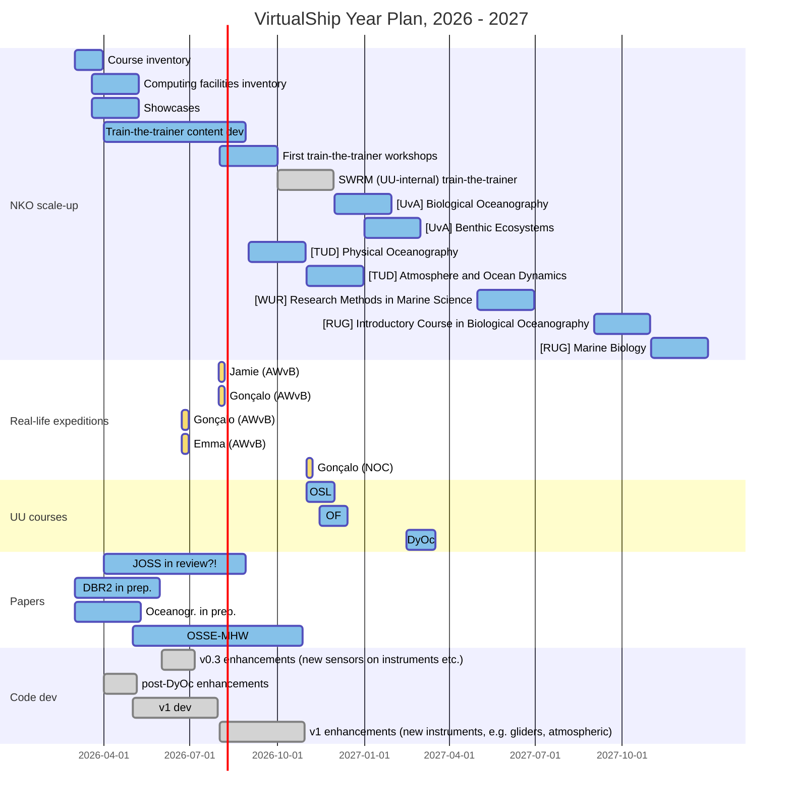

```mermaid
---
config:
  theme: default
---
%%{init: { 'themeVariables': {
    'doneTaskBkgColor': '#d3d3d3',
    'activeTaskBkgColor': '#85C1E9',
    'taskBkgColor': '#F7DC6F',
    'critBorderColor': '#ff0000'
}}}%%
gantt
    title VirtualShip Year Plan, 2026 - 2027
    dateFormat  YYYY-MM-DD
    tickInterval 3month
    weekday monday

    section NKO scale-up
    Course inventory    :active, 2026-03-01, 30d
    Computing facilities inventory :active, 2026-03-19, 50d
    Showcases           :active, 2026-03-19, 50d
    Train-the-trainer content dev   :active, 2026-04-01, 150d
    First train-the-trainer workshops :active, 2026-08-01, 62d
    SWRM (UU-internal) train-the-trainer :done, 2026-10-01, 60d
    [UvA] Biological Oceanography :active, 2026-12-01, 60d
    [UvA] Benthic Ecosystems :active, 2027-01-01, 60d
    [TUD] Physical Oceanography :active, 2026-09-01, 60d
    [TUD] Atmosphere and Ocean Dynamics :active, 2026-11-01, 60d
    [WUR] Research Methods in Marine Science :active, 2027-05-01, 60d
    [RUG] Introductory Course in Biological Oceanography :active, 2027-09-01, 60d
    [RUG] Marine Biology :active, 2027-11-01, 60d

    section Real-life expeditions
    Jamie (AWvB) :, 2026-07-31, 7d
    Gonçalo (AWvB) :, 2026-07-31, 7d
    Gonçalo (AWvB) :, 2026-06-22, 7d
    Emma (AWvB) :, 2026-06-22, 7d
    Gonçalo (NOC) :, 2026-11-01, 7d

    section UU courses
    OSL :active, 2026-11-01, 30d
    OF  :active, 2026-11-15, 30d
    DyOc :active, 2027-02-15, 30d

    section Papers
    JOSS in review?! :active, 2026-04-01, 150d
    DBR2 in prep. :active, 2026-03-01, 90d
    Oceanogr. in prep. :active, 2026-03-01, 70d
    OSSE-MHW :active, 2026-05-01, 180d


    section Code dev
    v0.3 enhancements (new sensors on instruments etc.) :done, 2026-06-01, 35d
    post-DyOc enhancements :done, 2026-04-01, 35d
    v1 dev       :done, 2026-05-01, 90d
    v1 enhancements (new instruments, e.g. gliders, atmospheric) :done, 2026-08-01, 90d

```
