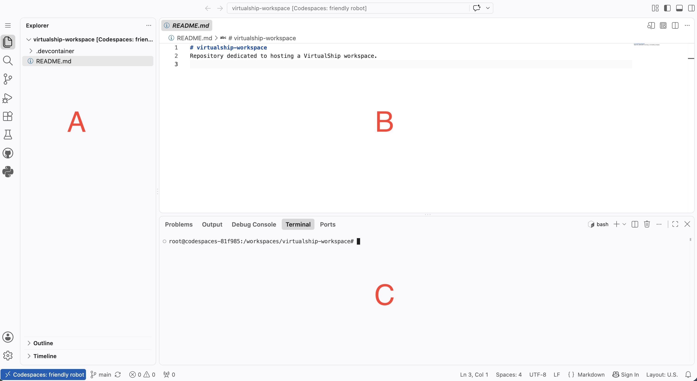
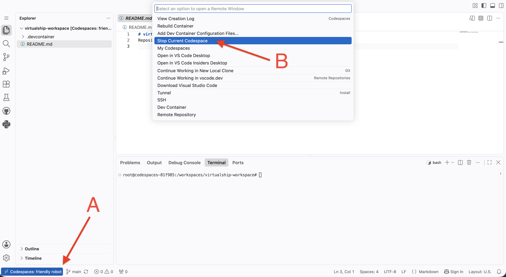

# Simulation Workspace Guide

For your classroom activities, we have provided a pre-configured cloud-based environment for the `VirtualShip` software. We host this facility on [GitHub](https://github.com/), for which you will need to create a free account. Please follow the steps below to access the VirtualShip Workspace and get started with your VirtualShip simulations.

## 1) Create a GitHub account

If you do not already have a GitHub account, please sign up for a free account here: [https://github.com/signup](https://github.com/signup)

## 2) Launch the VirtualShip Workspace via GitHub Codespaces

<!-- TODO: replace eventually with the Parcels-code hosted repo -->

Navigate to the VirtualShip Workspace repository on GitHub: [https://github.com/j-atkins/virtualship-workspace](https://github.com/j-atkins/virtualship-workspace)

From here you should see a green button labelled `Code`. Click on this button and select the `Codespaces` tab. Then click on the `Create codespace on main` button to launch your cloud-based environment.

It will take a few minutes for the Codespace to be created and launched. Once it is ready, you will see a web-based interface that looks similar to the [Visual Studio Code](https://code.visualstudio.com/) editor (if you are familiar with that).

```{important}
The spin-up time for the Codespace can take a few minutes. There are various stages, the last of which is a "Post Create Command" that will install the `VirtualShip` software and its dependencies. Please be patient and wait for this to complete before proceeding. Otherwise you may encounter errors and distruptions in your Codespace.
```

```{note}
In case you are interested, this will spin up a 2-core virtual machine with 8 GB of RAM. Not loads, but enough to run VirtualShip simulations for your course!
```

## 3) Using the VirtualShip simulation workspace

This browser-based virtual machine replicates the kind of set up you would have on your own computer, but it is hosted in the cloud. This means that you use the resources associated with the cloud instance, rather than your own computer, to run the software.

Your Codespace will look something like Figure 1 below:


_Figure 1. The VirtualShip Workspace interface._

Where `A` is the file explorer, `B` is the main editor window and `C` is the Terminal window. For VirtualShip, which is a [Command Line Interface (CLI)](https://www.w3schools.com/whatis/whatis_cli.asp) based tool, you will mainly be using the Terminal window to run commands.

Otherwise, you may find the editor window (`B`) helpful for example to [edit the VirtualShip configuration files](../user-guide/user-profiles/tutorials/working-with-expedition-yaml.md) when you reach this stage of the course.

The file explorer (`A`) will allow you to navigate the file structure of your Codespace, and you can also use it to upload/download files to/from your Codespace by right-clicking on a file or folder and selecting the appropriate option.

### Persistent storage

Your instance of the VirtualShip simulation workspace is linked to your GitHub account. This means that any files which you create and/or modify (e.g. the output of your VirtualShip simulations) will be tied to your account and will persist between sessions. You can also download files to your own computer if you wish, or upload files from your computer to the workspace.

Each free user account is limited to approximately 15 GB of storage space per month, which should be sufficient for VirtualShip simulation outputs, which are not too large.

Please note though that if you delete your Codespace, all files will be deleted and will not be recoverable. If you ever need to delete your workspace and you have important files stored within it, make sure to save them to a location outside the Codespace before deleting it.

```{tip}
Deleting is not the same as stopping the Codespace. You can stop the Codespace when you are not using it to save your usage time, and then restart it later. See the instructions [below](#compute-usage-restrictions) for how to stop and restart your Codespace.
```

### Compute usage restrictions

```{important}
The amount of time you can use the Codespace is limited to approximately **60 hours per month** (per free GitHub account). This should be sufficient for your course, but it's good to be aware so that you can limit unnecessary usage. See also the GitHub docs for more information on [Codespaces usage limits](https://docs.github.com/en/billing/concepts/product-billing/github-codespaces).

```

```{tip}

You can stop the Codespace when you are not using it to save your usage time. To do this, click on the "Codespaces" button in the bottom left (`A` in the screenshot below) and then select the "Stop Current Workspace" option (`B`).


*Figure 2. Stopping the Codespace to save usage time.*

The process of stopping the workspace can take a few minutes, and you will see a message on the screen when it's complete. You will be able to restart the workspace at a later time, using the same instructions as [above](#launch-the-virtualship-workspace-via-github-codespaces).

It's good to know that by default the Codespace will automatically stop after 30 minutes of inactivity, these instructions are just for if you want to stop it manually before that time.

```

### Collaboration within groups

_[This section is under development]_

<!-- TODO: populate this area when have explored how to facilitate collaboration within groups on Codespaces -->

```{nbgallery}

<!-- TODO: not in place yet -->
collaboration.md
```
